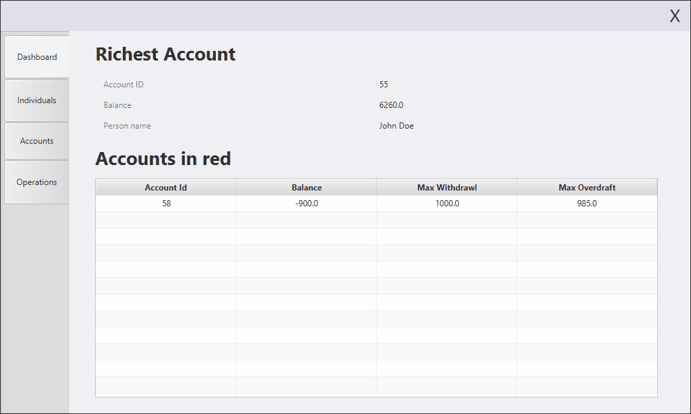

# Bank Management App
 This is a full CRUD javafx application for demo purposes. It uses the two main classes **Person** & **Account** with a OneToMany relation respectively (each Person has many Accounts).

 Some best practices, design patterns as well as custom FXML nodes are also implemented. 

 ## Technologies

- `Javafx` for the UI with java 11.
- `Hibernate` as the ORM, with a relational database.
- `Maven` as a dependency manager.

## Usage
1. Start a database.
2. Edit `src/main/resources/hibernate.cfg.xml` to match your database configuration.
3. Launch `application.bankuapp.App`

## Showcase
